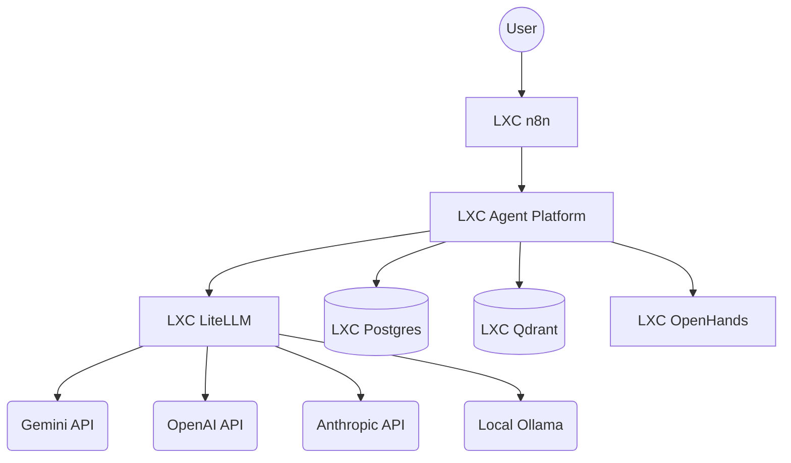

# Agent Platform Architecture

This document describes the high-level and component architecture of the Agent Platform.

## System-Level Architecture (LXC)

The platform is designed to run in a modular environment, typically using Proxmox LXC containers.

### Component Responsibilities

1.  **n8n**: Orchestrates the high-level workflow and triggers tasks on the Agent Platform via webhooks.
2.  **Agent Platform (This Repo)**: The core FastAPI backend. Manages agent lifecycles, state transitions, metadata storage, and interaction with other services.
3.  **LiteLLM**: Acts as a unified gateway for all Large Language Models. Standardizes requests/responses and provides complexity-based routing.
4.  **Postgres**: Relational database for storing execution history, steps, artifacts, and token usage.
5.  **Qdrant**: Vector database for semantic storage and retrieval of agent outputs and analyzed codebases.
6.  **OpenHands**: Coding-specific agent that performs the actual file modifications and command executions (Planned integration).

## Agent Platform Internal Architecture

The platform follows a modular design focused on decoupled storage and execution.

- **`apps/api`**: FastAPI application, routers, and dependencies.
- **`core/execution`**: The `AgentRunner` which implements a state machine for agent execution.
- **`core/llm`**: Unified `LiteLLMProvider` and `LiteLLMRouter`.
- **`core/storage`**: Abstractions for Postgres, Qdrant, and Google Drive.
- **`agents`**: Specialized agent implementations (e.g., `RepoAnalyzerAgent`, `MedicalAgent`).
- **`database`**: SQLAlchemy models and Alembic migrations.

## Target Task-to-Production Workflow

1.  **Task Initiation**: Received via API.
2.  **Analysis**: `RepoAnalyzerAgent` inspects the codebase.
3.  **Plan & Code**: OpenHands performs modifications.
4.  **Verification**: Automated tests run in a test environment.
5.  **Deployment**: Successful changes are pushed to production.
